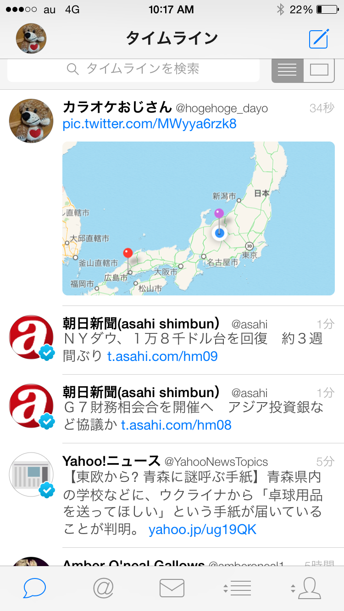

#:rice_ball:最終目的:rice_ball:

## *農業のSNS 🌾 ANS(AgricultureNetworkingService)を牛耳る*

# 田んぼ前線仕様

##機能

###田んぼ情報を登録 ※必須

端末から田んぼ情報をサーバーに登録できる。  
登録できる情報は  
・田んぼの緯度/経度  ※必須  
    とりあえずは端末のGPS機能から。ゆくゆくはマップから位置を決定、微調整できるようにしたい  
・フェーズ完了の年時 ※必須  
・完了したフェーズ（田植え/稲刈り）  
・米品種  
・田んぼID  
・ユーザーID  
・写真（複数登録可）  
・面積  
・収穫量  
・農薬情報(複数登録可)  
 使った農薬、結果、コメントなど  
また、過去の情報を田んぼIDにひも付けて登録できる。

###田んぼの情報をMAP上に一覧表示 ※必須
登録されている田んぼ情報をMAP上に表示できる。  
一旦は田植えが完了した田んぼをピンで表示する。

#### ☆よだちゃん情報
GoogleMapのAPIで地面、海の色を変えられる。田植えの緯度がxx度以上になってきたら地面が緑になるとかやったらおもしろそう。

### ユーザー登録
ANSを牛耳るために早めにほしいな。  
Twitterのフォロー機能がほしい。

### My田んぼの情報を登録/修正/閲覧
ユーザー登録すればMy田んぼの情報を登録/修正/閲覧できる。
My田んぼは複数登録できる。  
この田んぼは去年は x月x日に田植えしたとかが確認できる。

### 統計データの閲覧
登録されている田んぼ情報の統計データを閲覧できる.    
各地域の統計がとれると良い。  
九州の米の品種ランキングとか。  

### 田んぼ情報公開の限定
フォロワーにのみ公開するなど

### 田んぼ情報表示フィルター
フォロワーの田んぼのみ表示など

## 画面イメージ

下のボタンでモードを切り替える。
